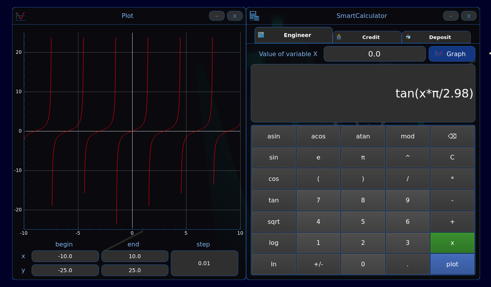
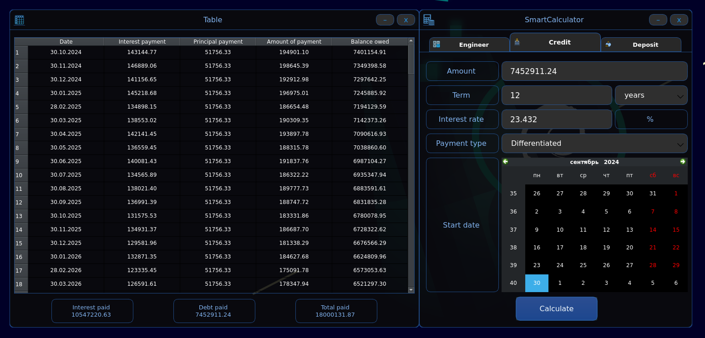
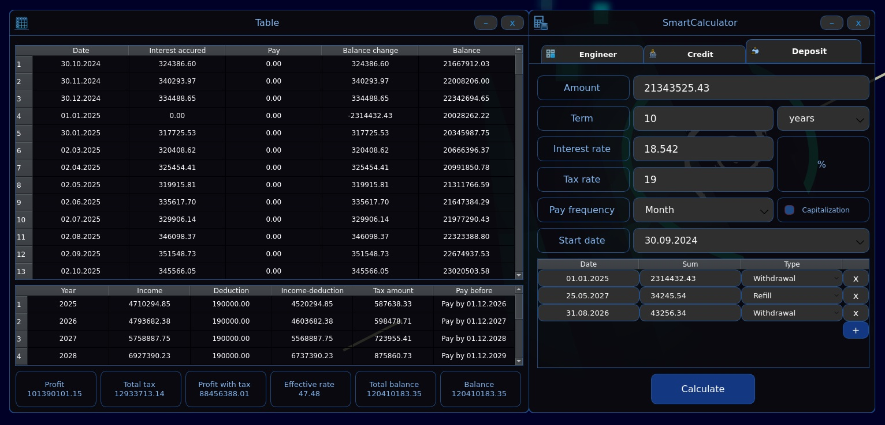

# SmartCalc v2.0

Implementation of SmartCalc v2.0.

The Russian version of the README can be found in the repository.

## Table of Contents
1. [Appearance](#appearance)
2. [Project Description](#project-description)
3. [Project Build](#project-build)
4. [Detailed Implementation Description](#detailed-implementation-description)
5. [Feedback](#feedback)

 

## Appearance

  
  
  

## Project Description

The goal of this project is to implement an extended version of a standard calculator using the C++ programming language and the MVC (Model-View-Controller) pattern. In addition to basic arithmetic operations such as addition, subtraction, multiplication, and division, the calculator supports the evaluation of arithmetic expressions with precedence as well as certain mathematical functions (sine, cosine, logarithm, etc.). The calculator also supports the use of the variable `x` and plotting the corresponding function. Additional features include credit and deposit calculators.

### Scientific Calculator

- The program is developed in C++ using the C17 standard and the g++ compiler, along with additional libraries and QT modules.
- The code resides in the `src` folder.
- The build process is managed with a Makefile, which includes standard GNU targets: `all`, `install`, `uninstall`, `clean`, `dvi`, `dist`, and `test`. The installation is placed in the `bin` directory.
- The program is developed following structured programming principles.
- The code is formatted according to the Google Style Guide.
- Unit tests covering the modules responsible for expression evaluation are implemented using the GTest library.
- The graphical user interface (GUI) is built using QT libraries with an API for C17.
- The input can include both integers and floating-point numbers (written using a dot). Numbers in exponential notation are also supported.
- The calculation is performed after the full expression is entered and the `=` button is pressed.
- The program evaluates arbitrary expressions in infix notation, with or without the `x` variable.
- The user can plot a graph of a function defined by an expression containing the `x` variable (complete with axes, a scale indicator, and a grid with adaptive spacing).
    - The user can adjust the graph's scale.
- The domain and range of functions are limited to at least the interval from `-1,000,000` to `1,000,000`.
    - The domain and range for graph plotting must be specified by the user.
- The program guarantees accuracy up to 7 decimal places.
- The user can input up to 255 characters.
- Infix notation expressions support the following arithmetic operations and mathematical functions:

**Arithmetic Operators**:

| Operator Name         | Infix Notation (Classic)   | Prefix Notation (Polish Notation) | Postfix Notation (Reverse Polish Notation) |
| --------------------- | -------------------------- | --------------------------------- | ----------------------------------------- |
| Parentheses           | (a + b)                    | (+ a b)                           | a b +                                     |
| Addition              | a + b                      | + a b                             | a b +                                     |
| Subtraction           | a - b                      | - a b                             | a b -                                     |
| Multiplication        | a * b                      | * a b                             | a b *                                     |
| Division              | a / b                      | / a b                             | a b \                                     |
| Exponentiation        | a ^ b                      | ^ a b                             | a b ^                                     |
| Modulo                | a mod b                    | mod a b                           | a b mod                                   |
| Unary Plus            | +a                         | +a                                | a+                                        |
| Unary Minus           | -a                         | -a                                | a-                                        |

> Expressions where the multiplication sign `*` is omitted are handled.

**Functions**:

| Description                        | Function  |   
| ----------------------------------- | --------- |  
| Calculates cosine                  | cos(x)    |   
| Calculates sine                    | sin(x)    |  
| Calculates tangent                 | tan(x)    |  
| Calculates arccosine               | acos(x)   | 
| Calculates arcsine                 | asin(x)   | 
| Calculates arctangent              | atan(x)   |
| Calculates square root             | sqrt(x)   |
| Calculates natural logarithm       | ln(x)     | 
| Calculates common logarithm        | log(x)    |

### Credit Calculator

The `Credit Calculator` mode offers:

- Input: total loan amount, loan term, interest rate, loan date, type (annuity or differentiated), early repayment options (shortening the term or reducing payments)
- Output: monthly payment, total interest, total payment, and a monthly report

### Deposit Calculator

The `Deposit Calculator` mode offers:

- Input: deposit amount, deposit term, interest rate, tax rate, deposit date, payment frequency, interest capitalization, and operations (additional deposits or partial withdrawals)
- Output: accrued interest, tax amount, total balance at the end of the term, and a monthly report

## Project Build

The Makefile includes the following main targets for working with the project:

| #  | Target           | Description                                                                              |
|----| ---------------- | ---------------------------------------------------------------------------------------- |
| 1  | `all`            | Builds the project and generates documentation.                                           |
| 2  | `install`        | Builds the project.                                                                       |
| 3  | `uninstall`      | Uninstalls the project.                                                                   |
| 4  | `clean`          | Cleans the repository of generated files.                                                 |
| 5  | `dvi`            | Generates documentation in HTML and manual formats.                                       |
| 6  | `dist`           | Compresses the project into a tar archive.                                                |
| 7  | `test`           | Runs unit tests.                                                                          |
| 8  | `clang_check`    | Checks code compliance with Google Style.                                                 |
| 9  | `cpplint`        | Lints the code to ensure Google Style compliance.                                         |
| 10 | `valgrind`       | Tests the program's memory usage using Valgrind.                                          |
| 11 | `dependencies`   | Installs necessary dependencies for building and testing the project.                     |

 

> Building the project on any operating system requires CMake and QTBase version 5.15 or higher.

## Detailed Implementation Description

The calculator allows switching between the scientific, credit, and deposit modes via a top tab bar.

### Scientific Calculator: Key Features

It has two working modes:

- Standard mode for evaluating mathematical expressions (including expressions with the `x` variable)
- Graphing mode for plotting mathematical expressions.

1. Most calculations and features were verified against the calculator at `web2.0calc.com`. Additional details were sourced from Google and Windows calculators.
2. The input is validated interactively to help users correct errors in mathematical expressions.
3. Trigonometric and logarithmic functions require parentheses after them.
4. The calculator supports implicit multiplication between numbers/functions/parentheses, such as `5log(2)`.
5. Scientific notation and the Euler number are supported. For example, `5e-2` is interpreted as `0.05`, and `5e*2` as `5*(Euler's number)*2`.
6. When using the `x` variable, a field for entering the value of `x` appears, which is also validated interactively.
7. An expression will not be evaluated if the `x` variable's value is invalid.
8. The domain and range for graphing must be specified by the user and are limited to `{1000000:-1000000}`.
9. A step size for the graph can be specified for more accurate plots. The allowed step size ranges from `{0.001:100}` (note: smaller steps increase computation time for large ranges).
10. Graph zooming and panning are supported.

### Credit Calculator: Key Features

1. Based on the advanced credit calculator from `calcus.ru`.
2. All user input fields are validated interactively.
3. The loan amount ranges from `{0.01:999999999999.99}`.
4. The loan term ranges from `{1:600}` months, `{1:50}` years.
5. The interest rate ranges from `{0.001:999}`.
6. Upon pressing `Calculate`, a full loan report is generated, including monthly breakdowns and total payments.

### Deposit Calculator: Key Features

1. Based on the deposit calculator from `calcus.ru`.
2. All user input fields are validated interactively.
3. The deposit amount ranges from `{0.01:999999999999.99}`.
4. The deposit term ranges from `{1:18250}` days, `{1:600}` months, `{1:50}` years.
5. The interest rate ranges from `{0.001:999}`.
6. Additional deposits and partial withdrawals are supported.
7. The same range applies to deposit amounts and withdrawal/additional deposit fields.
8. Various interest capitalization periods are available.
9. Upon pressing `Calculate`, a full report is generated, including monthly breakdowns, total interest, and taxes.

## Feedback

|          |                       |
| ---------| --------------------- |
| Email    | gabilov1997@gmail.com |
| Telegram | @kossadda             |
| VK       | vk.com/kossadda       |

[Back to top](#smartcalc-v20)