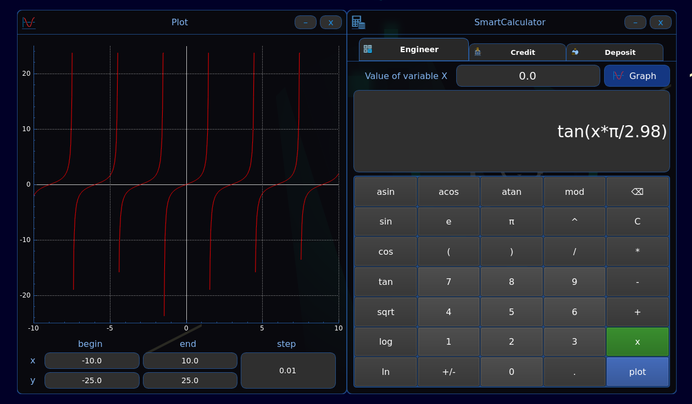

<a id="readme-top"></a>

 | [![Contributors][contributors-shield]][contributors-url] | [![Forks][forks-shield]][forks-url] | [![Stargazers][stars-shield]][stars-url] | [![Issues][issues-shield]][issues-url] | [![MIT License][license-shield]][license-url] | [![LinkedIn][linkedin-shield]][linkedin-url] |
 |:--------------------------------------------------------:|:------------------------------------:|:--------------------------------------:|:--------------------------------------:|:----------------------------------------:|:----------------------------------------:|


<br />
<div align="center">
  <a href="https://github.com/kossadda/SmartCalc_v2.0">
    
  </a>

  <h3 align="center">SmartCalc v2.0</h3>

  <p align="center">
    <br />
    <a href="https://github.com/kossadda/SmartCalc_v2.0"><strong>Изучите документацию »</strong></a>
    <br />
    <br />
    <a href="https://github.com/kossadda/SmartCalc_v2.0">Посмотреть демо</a>
    /
    <a href="https://github.com/kossadda/SmartCalc_v2.0/issues/new?labels=bug&template=bug-report---.md">Сообщить об ошибке</a>
    /
    <a href="https://github.com/kossadda/SmartCalc_v2.0/issues/new?labels=enhancement&template=feature-request---.md">Запросить доработку</a>
  </p>
</div>


<details>
  <summary><strong>Оглавление</strong></summary>
  <ol>
    <li>
      <a href="#о-проекте">О проекте</a>
      <ul>
        <li><a href="#инженерный-калькулятор">Инженерный калькулятор</a></li>
        <li><a href="#кредитный-калькулятор">Кредитный калькулятор</a></li>
        <li><a href="#депозитный-калькулятор">Депозитный калькулятор</a></li>
        <li><a href="#собрано-с-помощью">Собрано с помощью</a></li>
      </ul>
    </li>
    <li>
      <a href="#начало-работы">Начало работы</a>
      <ul>
        <li><a href="#необходимое-по">Необходимое ПО</a></li>
        <li><a href="#установка">Установка</a></li>
      </ul>
    </li>
    <li><a href="#участники">Участники</a></li>
    <li><a href="#лицензия">Лицензия</a></li>
    <li><a href="#контакты">Контакты</a></li>
  </ol>
</details>


## О проекте

 <br>
 <br>
 <br>

Цель данного проекта состоит в реализации на языке программирования C++ в паттерне MVC(Model View Controller) расширенной версии обычного калькулятора, который можно найти в стандартных приложениях каждой операционной системы. Помимо базовых арифметических операций, как плюс-минус и умножить-поделить, калькулятор дополнен возможностью вычисления арифметических выражений с учетом приоритетов, а так же некоторыми математическими функциями (синус, косинус, логарифм и т.д.). Помимо вычисления выражений калькулятор так же поддерживает использование переменной x и построение графика соответствующей функции. В качестве дополнительных улучшений реализованы кредитный и депозитный калькуляторы.

### Инженерный калькулятор

- Программа разработана на языке С++ стандарта C17 с использованием компилятора g++, дополнительных библиотек и модулей QT;
- Код программы находится в папке src;
- Сборка программы настроена с помощью Makefile со стандартным набором целей для GNU-программ: all, install, uninstall, clean, dvi, dist, test. Установка ведется в каталог bin;
- Программа разработана в соответствии с принципами структурного программирования;
- Форматирование кода произведено в соответствии с Google Style;
- Обеспечено покрытие unit-тестами модулей, связанных с вычислением выражений, с помощью библиотеки GTest;
- Реализация с графическим пользовательским интерфейсом базируется на GUI-библиотеках QT с API для C17;
- На вход программы подаются как целые числа, так и вещественные числа, записанные через точку. Обрабатан ввод чисел в экспоненциальной записи;
- Вычисление производится после полного ввода вычисляемого выражения и нажатия на символ `=`;
- Вычисление произвольных скобочных арифметических выражений в инфиксной нотации;
- Вычисление произвольных скобочных арифметических выражений в инфиксной нотации с подстановкой значения переменной `x` в виде числа;
- Построение графика функции, заданной с помощью выражения в инфиксной нотации с переменной `x` (с координатными осями, отметкой используемого масштаба и сеткой с адаптивным шагом);
    - Предоставление пользователю возможности менять масштаб;
- Область определения и область значения функций ограничиваются по крайней мере числами от `-1000000` до `1000000`;
    - Для построения графиков функции необходимо дополнительно указывать отображаемые область определения и область значения;
- Проверенная точность дробной части - 7 знаков после запятой;
- У пользователя имеется возможность ввода до 255 символов;
- Скобочные арифметические выражения в инфиксной нотации поддерживают следующие арифметические операции и математические функции:

**Арифметические операторы**:

| Название оператора   | Инфиксная нотация <br /> (Классическая) | Префиксная нотация <br /> (Польская нотация) |  Постфиксная нотация <br /> (Обратная польская нотация) |
| -------------------- | --------------------------------------- | -------------------------------------------- | ------------------------------------------------------- |
| Скобки               | (a + b)                                 | (+ a b)                                      | a b +                                                   |
| Сложение             | a + b                                   | + a b                                        | a b +                                                   |
| Вычитание            | a - b                                   | - a b                                        | a b -                                                   |
| Умножение            | a * b                                   | * a b                                        | a b *                                                   |
| Деление              | a / b                                   | / a b                                        | a b \                                                   |
| Возведение в степень | a ^ b                                   | ^ a b                                        | a b ^                                                   |
| Остаток от деления   | a mod b                                 | mod a b                                      | a b mod                                                 |
| Унарный плюс         | +a                                      | +a                                           | a+                                                      |
| Унарный минус        | -a                                      | -a                                           | a-                                                      |

> Произведена обработка выражения с опущенным знаком `*`.

**Функции**:

| Описание функции               | Функция |   
| ------------------------------ | ------- |  
| Вычисляет косинус              | cos(x)  |   
| Вычисляет синус                | sin(x)  |  
| Вычисляет тангенс              | tan(x)  |  
| Вычисляет арккосинус           | acos(x) | 
| Вычисляет арксинус             | asin(x) | 
| Вычисляет арктангенс           | atan(x) |
| Вычисляет квадратный корень    | sqrt(x) |
| Вычисляет натуральный логарифм | ln(x)   | 
| Вычисляет десятичный логарифм  | log(x)  |

Имеет два режима работы:

- Стандартный режим подсчета математических выражений (а также выражений, включающих в себя переменную `x`) 
- Режим построения графика по математическому выражению.

1. По большей части, сверка расчетов и некоторых элементов калькулятора произоводилась основываясь на калькуляторе с сайта `web2.0calc.com`. Некоторые моменты были подчерпнуты с калькуляторов Google и Windows.
2. Происходит интерактивная валидация ввода, которая подскажет правильно ли введено математическое выражение;
3. Ввод тригонометрических и логарифмических функций осуществляется исключительно через открывающуюся после них скобку;
4. Калькулятор полностью поддерживает слитное написание функций/чисел/скобок между собой, имитируя между ними умножение. Например, `5log(2)` - допустимое написание;
5. Поддерживается написание научной нотации чисел и применение числа Эйлера. То есть `5e-2` будет считаться как `0.05`, а `5e*2` будет `5*(число эйлера)*2`;
6. В режиме ввода переменной появляется поле ввода значения `x`, которое также интерактивно валидируется;
7. В режиме ввода переменной подсчет выражения не произведется, если введено некорректное значение `x`;
8. Ввод области определения и допустимых значений функции интерактивно валидируется. Области определений ограничены диапазном в `{1000000:-1000000}`;
9. Доступен ввод необходимого шага графика для построения более точных графиков. Диапазон допустимого шага варъируется в диапазоне `{0.001:100}` (следует также отметить, что при большой области допустимых значений, то есть диапазоне `x` - чем меньше шаг, тем дольше выполняется построение);
10. Доступно зумирование графика и интерактивное перемещеное по координатной плоскости;

### Кредитный калькулятор

Предусмотрен специальный режим `кредитный калькулятор`:
 - Вход: общая сумма кредита, срок, процентная ставка, дата кредитования, тип (аннуитетный, дифференцированный), досрочные погашения (уменьшение срока, уменьшение выплат)
 - Выход: ежемесячный платеж, переплата по кредиту, общая выплата, ежемесячный отчет

1. За основу был взят расширенный кредитный калькулятор с сайта `calcus.ru`;
2. Интерактивно валидируются все поля пользовательского ввода;
3. Сумма кредита варъируется в диапазане `{0.01:999999999999.99}`;
4. Срок кредита варъируется в диапазоне `{1:600}` - месяцев, `{1:50}` - лет;
5. Процентная ставка варъируется в диапазоне `{0.001:999}`;
6. При нажатии на кнопку `Calculate` формируется полный отчет о кредите, содержащий информацию о каждом месяце кредита и общие показатели по выплаченным суммам.

### Депозитный калькулятор

Предусмотрен специальный режим `калькулятор доходности вкладов`:
 - Вход: сумма вклада, срок размещения, процентная ставка, налоговая ставка, дата депозита, периодичность выплат, капитализация процентов, операции (пополнения, частичные снятия)
 - Выход: начисленные проценты, сумма налога, сумма на вкладе к концу срока, ежемесячный отчет

1. За основу был взят депозитный калькулятор с сайта `calcus.ru`;
2. Интерактивно валидируются все поля пользовательского ввода;
3. Сумма кредита варъируется в диапазане `{0.01:999999999999.99}`;
4. Срок кредита варъируется в диапазоне `{1:18250}` - дней, `{1:600}` - месяцев, `{1:50}` - лет;
5. Процентная ставка варъируется в диапазоне `{0.001:999}`;
6. Доступна возможность проведения операций пополнения и частичных снятий средств с депозита;
7. Поле ввода суммы пополнений/снятий имеет тот же диапазан, что и у суммы депозита.
8. Доступны всевозможные вариации периодов капитализации счета.
9. При нажатии на кнопку `Calculate` формируется полный отчет о депозите, содержащий информацию о каждом периоде капитализации счета, общие показатели по выплаченным суммам и суммам налогообложений.

<p align="right">(<a href="#readme-top">наверх</a>)</p>

### Собрано с помощью

<p align="center">
  <p>
    <a href="https://www.cplusplus.com/">
      
    </a>
    <a href="https://cmake.org/">
      
    </a>
    <a href="https://www.qt.io/">
      
    </a>
  </p>
</p>

<p align="right">(<a href="#readme-top">наверх</a>)</p>


## Начало работы

Чтобы получить локальную копию и запустить ее, выполните следующие шаги.

### Необходимое ПО

* CMake
  ```
  sudo apt install cmake
  ```

* Qt
  ```
  sudo apt install qt6-base-dev
  ```

### Установка

1. Установите необходимое ПО (если отсутствует)
2. Склонируйте репозиторий
    ```sh
    git clone git@github.com:kossadda/SmartCalc_v2.0.git
    ```
3. Запустите программу установки
    ```sh
    make install
    ```
4. Запустите программу вручную (`SmartCalc_v2.0/bin/smartcalc`) или введите команду
    ```
    make run
    ```

<p align="right">(<a href="#readme-top">наверх</a>)</p>


## Участники:

<a href="https://github.com/kossadda/SmartCalc_v2.0/graphs/contributors">
  
</a>

<p align="right">(<a href="#readme-top">наверх</a>)</p>


## Лицензия

Распространяется по лицензии MIT. Смотрите `LICENSE.txt` для получения дополнительной информации.

<p align="right">(<a href="#readme-top">наверх</a>)</p>


## Контакты

Первин Габилов - [Telegram](https://t.me/kossadda) / gabiov1997@gmail.com

<p align="right">(<a href="#readme-top">наверх</a>)</p>


<!-- ССЫЛКИ И ИЗОБРАЖЕНИЯ MARKDOWN -->
[contributors-shield]: https://img.shields.io/github/contributors/kossadda/SmartCalc_v2.0.svg?style=for-the-badge
[contributors-url]: https://github.com/kossadda/SmartCalc_v2.0/graphs/contributors
[forks-shield]: https://img.shields.io/github/forks/kossadda/SmartCalc_v2.0.svg?style=for-the-badge
[forks-url]: https://github.com/kossadda/SmartCalc_v2.0/network/members
[stars-shield]: https://img.shields.io/github/stars/kossadda/SmartCalc_v2.0.svg?style=for-the-badge
[stars-url]: https://github.com/kossadda/SmartCalc_v2.0/stargazers
[issues-shield]: https://img.shields.io/github/issues/kossadda/SmartCalc_v2.0.svg?style=for-the-badge
[issues-url]: https://github.com/kossadda/SmartCalc_v2.0/issues
[license-shield]: https://img.shields.io/github/license/kossadda/SmartCalc_v2.0.svg?style=for-the-badge
[license-url]: https://github.com/kossadda/SmartCalc_v2.0/blob/master/LICENSE.txt
[linkedin-shield]: https://img.shields.io/badge/-LinkedIn-black.svg?style=for-the-badge&logo=linkedin&colorB=555
[linkedin-url]: https://linkedin.com/in/othneildrew
